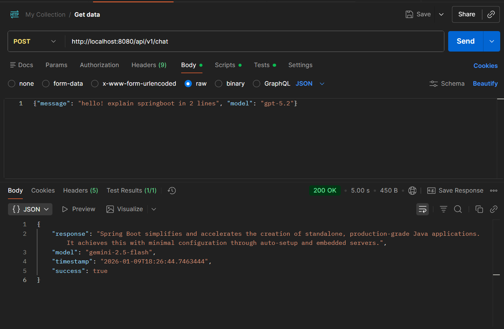
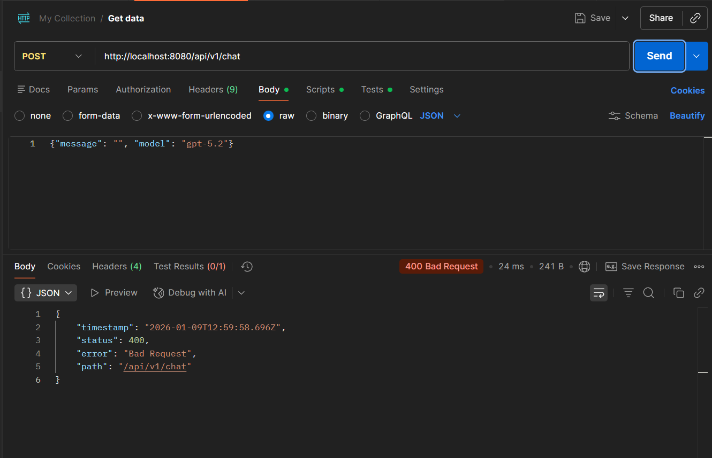

# AI Assistant Service

A Spring Boot-based REST API service that integrates with Google Gemini AI to provide intelligent chat capabilities. This service acts as a middleware layer between clients and Google's Gemini API, offering a clean, standardized interface for AI-powered conversations.

## Table of Contents

- [Overview](#overview)
- [Architecture](#architecture)
- [Technology Stack](#technology-stack)
- [Project Structure](#project-structure)
- [Data Models](#data-models)
- [API Endpoints](#api-endpoints)
- [Configuration](#configuration)
- [Getting Started](#getting-started)
- [Error Handling](#error-handling)
- [Dependencies](#dependencies)

---

## Overview

The AI Assistant Service is a microservice designed to provide AI chat functionality through Google Gemini API integration. It offers:

- **RESTful API** for AI chat interactions
- **Model validation and normalization** for Gemini models
- **Reactive programming** support using Spring WebFlux
- **Comprehensive error handling** with standardized error responses
- **Health check endpoints** for monitoring
- **Request validation** with Jakarta Bean Validation

### Key Features

- ✅ Integration with Google Gemini AI models
- ✅ Support for multiple Gemini models (gemini-2.5-flash, gemini-1.5-pro, etc.)
- ✅ Reactive, non-blocking API responses using Project Reactor
- ✅ Input validation and sanitization
- ✅ Centralized configuration management
- ✅ Spring Boot Actuator for health monitoring
- ✅ Comprehensive logging with SLF4J

---

## Architecture

### High-Level Architecture

```
┌─────────────┐
│   Client    │
│ (HTTP REST) │
└──────┬──────┘
       │
       │ HTTP Request
       ▼
┌─────────────────────────────────────┐
│   AiAssistantController             │
│   (REST API Layer)                  │
│   - Request Validation              │
│   - Response Mapping                │
└──────────────┬──────────────────────┘
               │
               │ ChatRequest
               ▼
┌─────────────────────────────────────┐
│   AiAssistantService                │
│   (Business Logic Layer)            │
│   - Model Validation                │
│   - Request Transformation          │
│   - Response Building               │
└──────────────┬──────────────────────┘
               │
               │ Validated Request
               ▼
┌─────────────────────────────────────┐
│   GeminiClient                      │
│   (Integration Layer)               │
│   - HTTP Communication              │
│   - Request/Response Mapping        │
│   - Error Handling                  │
└──────────────┬──────────────────────┘
               │
               │ HTTP POST (WebClient)
               ▼
┌─────────────────────────────────────┐
│   Google Gemini API                 │
│   (External Service)                │
└─────────────────────────────────────┘
```

### Component Architecture

#### 1. **Controller Layer** (`com.assistant.ai.controller`)
- **Responsibility**: Handle HTTP requests/responses, input validation
- **Components**: `AiAssistantController`

#### 2. **Service Layer** (`com.assistant.ai.service`)
- **Responsibility**: Business logic, model validation, orchestration
- **Components**: `AiAssistantService`

#### 3. **Client Layer** (`com.assistant.ai.client`)
- **Responsibility**: External API integration, HTTP communication
- **Components**: `GeminiClient`, `GeminiRequest`, `GeminiResponse`

#### 4. **Configuration Layer** (`com.assistant.ai.config`)
- **Responsibility**: Bean configuration, external API setup
- **Components**: `GeminiConfig`

#### 5. **Data Transfer Objects** (`com.assistant.ai.dto`)
- **Responsibility**: Request/response data structures
- **Components**: `ChatRequest`, `ChatResponse`, `ApiErrorResponse`

#### 6. **Exception Handling** (`com.assistant.ai.exception`)
- **Responsibility**: Custom exceptions for error propagation
- **Components**: `GeminiException`

#### 7. **Model Layer** (`com.assistant.ai.model`)
- **Responsibility**: Domain models and enums
- **Components**: `AiModel`

### Request Flow

1. **Client Request** → HTTP POST to `/api/v1/chat`
2. **Controller** → Validates `ChatRequest` using Jakarta Validation
3. **Service** → Validates/normalizes model name, creates validated request
4. **Client** → Transforms request to Gemini API format, makes HTTP call
5. **Gemini API** → Processes request, returns AI response
6. **Client** → Extracts response text from Gemini response structure
7. **Service** → Builds `ChatResponse` with metadata
8. **Controller** → Returns HTTP 200 OK with `ChatResponse`

---

## Technology Stack

### Core Framework
- **Spring Boot** `4.0.1` - Application framework
- **Java** `17` - Programming language

### Web & Reactive
- **Spring WebMVC** - REST API support
- **Spring WebFlux** - Reactive programming support
- **Project Reactor** - Reactive streams implementation (Mono/Flux)

### Validation & Processing
- **Jakarta Bean Validation** - Input validation
- **Jackson Databind** - JSON serialization/deserialization

### Utilities
- **Lombok** - Reduces boilerplate code (@Data, @Builder, etc.)
- **SLF4J** - Logging framework

### Monitoring
- **Spring Boot Actuator** - Health checks and metrics

### Build Tool
- **Maven** - Dependency management and build tool

---

## Project Structure

```
ai-assistant-service/
├── src/
│   ├── main/
│   │   ├── java/
│   │   │   └── com/assistant/ai/
│   │   │       ├── AiAssistantServiceApplication.java    # Main application class
│   │   │       ├── controller/
│   │   │       │   └── AiAssistantController.java        # REST controller
│   │   │       ├── service/
│   │   │       │   └── AiAssistantService.java           # Business logic
│   │   │       ├── client/
│   │   │       │   ├── GeminiClient.java                 # External API client
│   │   │       │   └── dto/
│   │   │       │       ├── GeminiRequest.java            # Gemini API request DTO
│   │   │       │       └── GeminiResponse.java           # Gemini API response DTO
│   │   │       ├── config/
│   │   │       │   └── GeminiConfig.java                 # Configuration beans
│   │   │       ├── dto/
│   │   │       │   ├── request/
│   │   │       │   │   └── ChatRequest.java              # API request DTO
│   │   │       │   └── response/
│   │   │       │       ├── ChatResponse.java             # API response DTO
│   │   │       │       └── ApiErrorResponse.java         # Error response DTO
│   │   │       ├── exception/
│   │   │       │   └── GeminiException.java              # Custom exception
│   │   │       └── model/
│   │   │           └── AiModel.java                      # AI model enum
│   │   └── resources/
│   │       └── application.properties                    # Configuration file
│   └── test/
│       └── java/
│           └── com/assistant/ai/
│               └── AiAssistantServiceApplicationTests.java
├── pom.xml                                                # Maven configuration
└── README.md                                              # This file
```

---

## Data Models

### Request DTOs

#### `ChatRequest`
Represents the incoming chat request from clients.

| Field | Type | Constraints | Description |
|-------|------|-------------|-------------|
| `message` | `String` | Required, 1-10000 chars | The message/prompt to send to AI |
| `model` | `String` | Optional, max 50 chars | AI model name (e.g., "gemini-2.5-flash") |

**Example:**
```json
{
  "message": "What is artificial intelligence?",
  "model": "gemini-2.5-flash"
}
```

### Response DTOs

#### `ChatResponse`
Standard response structure for successful chat requests.

| Field | Type | Description |
|-------|------|-------------|
| `response` | `String` | The AI-generated response text |
| `model` | `String` | The model that was used to generate the response |
| `timestamp` | `LocalDateTime` | When the response was generated |
| `success` | `boolean` | Always `true` for successful responses |

**Example:**
```json
{
  "response": "Artificial intelligence (AI) is...",
  "model": "gemini-2.5-flash",
  "timestamp": "2024-01-15T10:30:45",
  "success": true
}
```

#### `ApiErrorResponse`
Standardized error response structure.

| Field | Type | Description |
|-------|------|-------------|
| `timestamp` | `LocalDateTime` | When the error occurred |
| `status` | `int` | HTTP status code |
| `error` | `String` | Error type/category |
| `message` | `String` | Human-readable error message |
| `path` | `String` | Request path where error occurred |
| `details` | `List<String>` | Additional error details (optional) |

**Example:**
```json
{
  "timestamp": "2024-01-15T10:30:45",
  "status": 400,
  "error": "Validation Error",
  "message": "Message cannot be blank",
  "path": "/api/v1/chat",
  "details": ["message: Message cannot be blank"]
}
```

### Internal DTOs (Gemini API)

#### `GeminiRequest`
Request structure for Google Gemini API.

```json
{
  "contents": [{
    "parts": [{
      "text": "user message"
    }]
  }]
}
```

#### `GeminiResponse`
Response structure from Google Gemini API.

```json
{
  "candidates": [{
    "content": {
      "parts": [{
        "text": "AI response text"
      }]
    }
  }]
}
```

### Model Enum

#### `AiModel`
Enumeration of supported Gemini models.

| Model | Enum Value | Description |
|-------|-----------|-------------|
| `gemini-2.5-flash` | `GEMINI_2_5_FLASH` | Latest fast model (recommended) |
| `gemini-2.0-flash` | `GEMINI_2_0_FLASH` | Previous generation flash model |
| `gemini-1.5-pro` | `GEMINI_1_5_PRO` | Advanced capabilities model |
| `gemini-1.5-flash` | `GEMINI_1_5_FLASH` | Fast model from 1.5 generation |

**Note**: Models starting with `gemini-` are also accepted for forward compatibility with new models.

### Exception Model

#### `GeminiException`
Custom exception for Gemini API errors.

| Field | Type | Description |
|-------|------|-------------|
| `message` | `String` | Error message (from RuntimeException) |
| `statusCode` | `int` | HTTP status code from API error |

---

## API Endpoints

### Base URL
```
http://localhost:8080/api/v1/ai
```

### Endpoints

#### 1. Chat Endpoint

**POST** `/chat`

Send a message to the AI and receive a response.

**Request Headers:**
```
Content-Type: application/json
Accept: application/json
```

**Request Body:**
```json
{
  "message": "What is Spring Boot?",
  "model": "gemini-2.5-flash"
}
```

**Response:** `200 OK`
```json
{
  "response": "Spring Boot is a framework...",
  "model": "gemini-2.5-flash",
  "timestamp": "2024-01-15T10:30:45",
  "success": true
}
```

**Validation Errors:** `400 Bad Request`
- Message is blank or exceeds 10000 characters
- Model name exceeds 50 characters

**Server Errors:** `500 Internal Server Error`
- Gemini API errors
- Network/timeout errors
- Invalid response structure

**cURL Example:**
```bash
curl -X POST http://localhost:8080/api/v1/chat \
  -H "Content-Type: application/json" \
  -d '{
    "message": "Explain quantum computing in simple terms",
    "model": "gemini-2.5-flash"
  }'
```

#### 2. Health Check Endpoint

**GET** `/health`

Check if the service is running.

**Response:** `200 OK`
```
AI Assistant Service is running
```

**cURL Example:**
```bash
curl http://localhost:8080/api/v1/health
```

### Actuator Endpoints

Spring Boot Actuator endpoints are available at `/actuator`:

- **GET** `/actuator/health` - Detailed health information
- **GET** `/actuator/info` - Application information

### Postman Examples

#### Success Response



#### Error Response



---

## Configuration

### Application Properties

Configuration is managed in `src/main/resources/application.properties`:

```properties
# Application Configuration
spring.application.name=ai-assistant-service
server.port=8080

# Google Gemini AI Configuration
gemini.api-key=YOUR_API_KEY_HERE
gemini.model=gemini-2.5-flash
gemini.base-url=https://generativelanguage.googleapis.com/v1beta

# Logging Configuration
logging.level.com.assistant.ai=INFO
logging.level.org.springframework.web=INFO
logging.pattern.console=%d{yyyy-MM-dd HH:mm:ss} - %msg%n

# Actuator Configuration
management.endpoints.web.exposure.include=health,info
management.endpoint.health.show-details=when-authorized
```

### Configuration Properties

| Property | Required | Default | Description |
|----------|----------|---------|-------------|
| `gemini.api-key` | ✅ Yes | - | Google Gemini API key |
| `gemini.model` | ❌ No | `gemini-2.5-flash` | Default Gemini model |
| `gemini.base-url` | ❌ No | `https://generativelanguage.googleapis.com/v1beta` | Gemini API base URL |
| `server.port` | ❌ No | `8080` | Server port |

### Environment Variables

You can override configuration using environment variables:

```bash
export GEMINI_API_KEY=your_api_key_here
export SERVER_PORT=9090
```

Or use Spring Boot's property override mechanism:

```bash
java -jar ai-assistant-service.jar --gemini.api-key=your_api_key
```

---

## Getting Started

### Prerequisites

- **Java 17** or higher
- **Maven 3.6+**
- **Google Gemini API Key** ([Get one here](https://makersuite.google.com/app/apikey))

### Build and Run

#### 1. Clone the Repository
```bash
git clone <repository-url>
cd ai-assistant-service
```

#### 2. Configure API Key

Edit `src/main/resources/application.properties` and set your Gemini API key:
```properties
gemini.api-key=YOUR_API_KEY_HERE
```

#### 3. Build the Project
```bash
./mvnw clean install
# On Windows:
# mvnw.cmd clean install
```

#### 4. Run the Application
```bash
./mvnw spring-boot:run
# On Windows:
# mvnw.cmd spring-boot:run
```

Or run the JAR directly:
```bash
java -jar target/ai-assistant-service-0.0.1-SNAPSHOT.jar
```

#### 5. Verify the Service

Check health endpoint:
```bash
curl http://localhost:8080/api/v1/health
```

### Development

#### Running Tests
```bash
./mvnw test
```

#### Building Without Tests
```bash
./mvnw clean install -DskipTests
```

---

## Error Handling

### Error Response Structure

All errors follow the `ApiErrorResponse` structure:

```json
{
  "timestamp": "2024-01-15T10:30:45",
  "status": 400,
  "error": "Bad Request",
  "message": "Validation failed",
  "path": "/api/v1/chat",
  "details": ["message: Message cannot be blank"]
}
```

### Error Scenarios

#### 1. Validation Errors (400 Bad Request)
- **Cause**: Invalid request data
- **Example**: Blank message, message too long, invalid model format
- **Response**: Includes validation error details

#### 2. Gemini API Errors (500 Internal Server Error)
- **Cause**: Gemini API call failed
- **Examples**: 
  - Invalid API key
  - API rate limit exceeded
  - Invalid model name
  - Network timeout
- **Response**: Includes error message from API

#### 3. Server Errors (500 Internal Server Error)
- **Cause**: Unexpected application errors
- **Examples**:
  - Null pointer exceptions
  - Configuration errors
  - Internal processing failures

### Exception Propagation

1. **Validation Errors** → Handled by Spring's `@Valid` annotation
2. **GeminiClient Errors** → Caught and wrapped in `GeminiException`
3. **Service Errors** → Propagated to controller, handled by Spring Boot

### Logging

All errors are logged with appropriate log levels:
- **INFO**: Normal request processing
- **WARN**: Model validation warnings (fallback to default)
- **ERROR**: API errors, exceptions, failures

---

## Dependencies

### Core Dependencies

```xml
<!-- Spring Boot Starter WebMVC -->
<dependency>
    <groupId>org.springframework.boot</groupId>
    <artifactId>spring-boot-starter-webmvc</artifactId>
</dependency>

<!-- Spring Boot Validation -->
<dependency>
    <groupId>org.springframework.boot</groupId>
    <artifactId>spring-boot-starter-validation</artifactId>
</dependency>

<!-- Spring WebFlux (Reactive) -->
<dependency>
    <groupId>org.springframework.boot</groupId>
    <artifactId>spring-boot-starter-webflux</artifactId>
</dependency>

<!-- Lombok -->
<dependency>
    <groupId>org.projectlombok</groupId>
    <artifactId>lombok</artifactId>
    <optional>true</optional>
</dependency>

<!-- Jackson Databind -->
<dependency>
    <groupId>com.fasterxml.jackson.core</groupId>
    <artifactId>jackson-databind</artifactId>
</dependency>

<!-- Spring Boot Actuator -->
<dependency>
    <groupId>org.springframework.boot</groupId>
    <artifactId>spring-boot-starter-actuator</artifactId>
</dependency>
```

### Transitive Dependencies

- **Project Reactor** (via WebFlux): Reactive streams
- **Jakarta Validation API**: Bean validation
- **SLF4J + Logback**: Logging framework
- **Jackson Core**: JSON processing

---

## Additional Notes

### Model Validation Logic

The service implements intelligent model validation:

1. **Null/Empty Model** → Uses default from configuration
2. **Known Model (Enum)** → Uses exact model name (case-insensitive)
3. **Model Starting with "gemini-"** → Accepted for forward compatibility
4. **Invalid Model** → Logs warning and falls back to default

This allows the service to work with future Gemini models without code changes.

### Reactive Programming

The service uses **Project Reactor's `Mono`** for reactive, non-blocking API calls:
- Non-blocking HTTP calls to Gemini API
- Efficient resource utilization
- Better scalability under high load

### Timeouts

Default timeout for Gemini API calls: **30 seconds**

This can be adjusted by modifying `DEFAULT_TIMEOUT` in `GeminiClient.java`.

---

## Author

Shruthi N V

---

## Version History

- **v0.0.1-SNAPSHOT** - Initial release
  - Basic chat functionality
  - Gemini API integration
  - Model validation
  - Error handling


